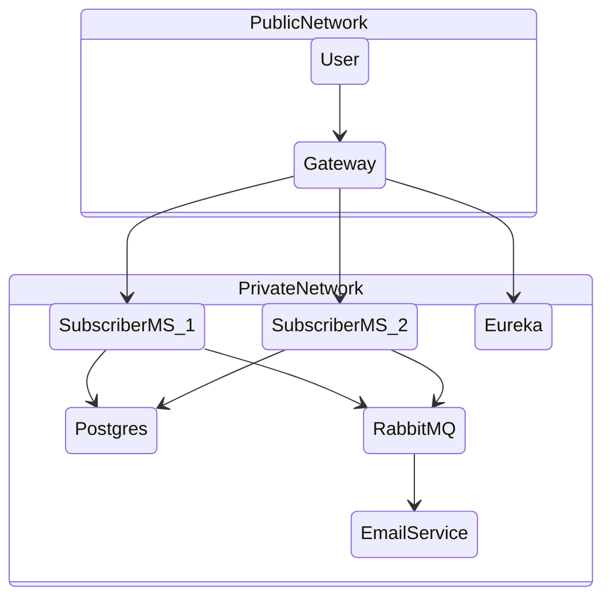

# Challenge
Solution architecture

To run the application for the first time, run the containers in the 
`docker-compose.yml` except the  email service because the Queue is not declared yet.

After that run the applications, run the endpoint to subscribe and create the first user.
You can use any valid email (because the application you acctually send 👽️. But if its not valid its OK too, but you i'll never receive the newsletter 🍻), 
and the first name and gender is not mandatory:
```
http://host:8080/subscription
```
```json
{
  "email": "your@email.com",
  "firstName": null,
  "gender": MALE|FEMALE|NON_BINARY|null,
  "dateOfBirth": "yyyy-mm-dd",
  "newsletterId": "01b3b693-c48a-4a80-a369-5afcb284639a", -- Important to receive email
  "consent": true -- could be false but you dont receive email 
}
```
To receive a publication I mocked some answer. 

The {UUID-newletter} 
has to be one registred in database before. If you runned the command before 
to register the user you are good to go with `01b3b693-c48a-4a80-a369-5afcb284639a` (Could be any valid UUID).
The {UUID-publication}
Could be any UUID valid. Go with `2a866ebe-189d-48ff-b59e-72a78230be16`, for example.

The  run the endpoint with the URL:
```
http://host:8080/subscription/{UUID-newletter}/publication/{UUID-publication}
```

My ideia here it was that some other microservice was responsible to register the publications
in a mongo database. The publication microservice calls the subscription inside the docker  private 
network throug a Rest communication to create the topics in RabbitMQ to each subscriber.

After the publication our email service would retrive the publication in mongo 
and send to our desired subscriber in the topic.

After the Queue its created you can run the email service and will consume 
the messages in Queue, after that see your mailbox to receive the `Hello! :)`.